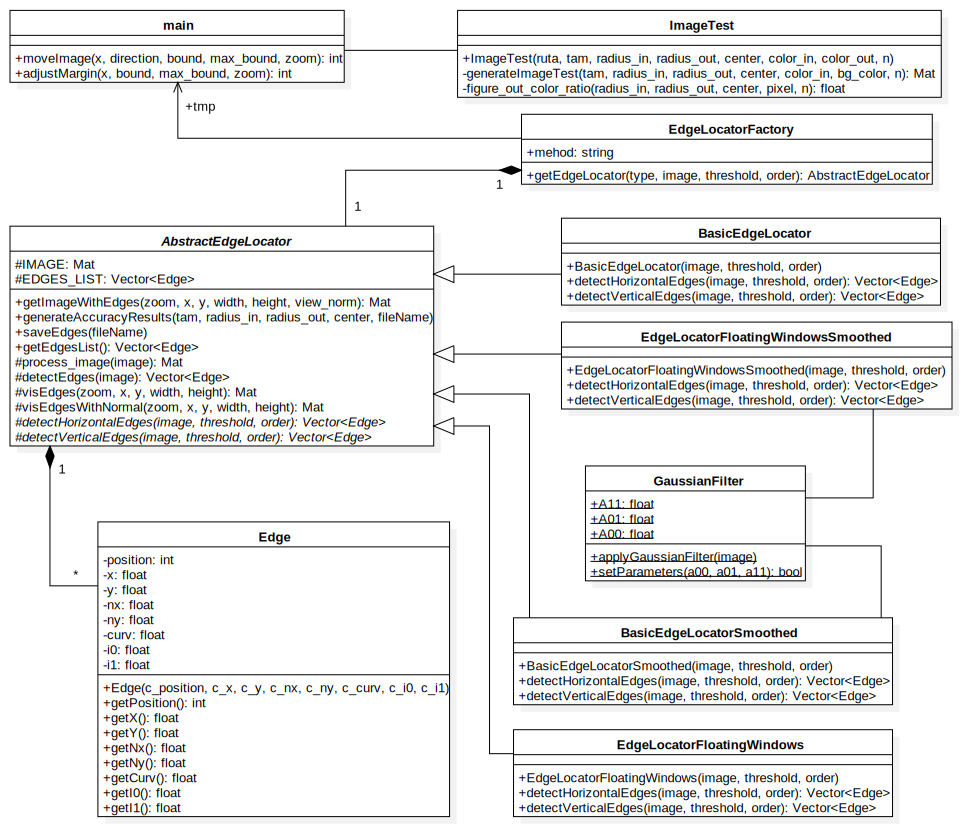

[English version](./Implementation.md)

<h2>Detalles de implementación:</h2>

Las distintas aproximaciones al método se han codificado en clases separadas. Todas ellas heredan su comportamiento común de la clase abstracta *AbstractEdgeLocator*. La clase que recoge la primera aproximación es *BasicEdgeLocator*. Esta primera implementación es una trascripción del método usando ventanas estáticas de 3x5 y de 5x3 y no hace uso del suavizado de bordes. La segunda aproximación se encuentra implementada en la clase *BasicEdgeLocatorSmoothed*, como sugiere su nombre en esta clase se realiza un suavizado de los bordes antes del cálculo del resto de parámetros. Del mismo modo que en el método anterior utiliza ventanas estáticas pero de 3x9 o 9x3, debido al efecto de expansión de los bordes descrito anteriormente en la explicación del método. La tercera aproximación se desarrolla en la clase *EdgeLocatorFloatingWindowsSmoothed*. En esta clase ya se hace uso del suavizado de imagen y de las ventanas flotantes. Adicionalmente a estas tres clases se ha desarrollado la clase *EdgeLocatorFloatingWindows* que funciona con ventanas flotantes pero que no utiliza ningún tipo de suavizado previo a los cálculos.

	

El proceso de detección de los bordes sigue en todos los casos un mismo esquema, esto es: primero se pasa la imagen a blanco y negro, el segundo paso sería el suavizado de la imagen, siempre que se haya elegido esa opción. Con la imagen ya en blanco y negro se pasaría a calcular las derivadas parciales y con ellas el gradiente, posteriormente se llama al método de detección de bordes horizontales, seguidamente al método de detección de bordes verticales, y por último se llama al método para visualizar los bordes cálculados en el proceso. En los pasos de detección de bordes se irá guardando los resultados en una estructura dinámica *Vector* que almacena objetos *Edge*.

Los objetos *Edge* son la unidad mímima de información del resultado de la ejecución. La estructura del objeto *Edge* es la siguiente:

- position: Almacena la posición del píxel borde dentro de la matriz de bytes de la imagen.
- x: Representa la posición horizontal de izquierda a derecha en coordenadas cartesianas del píxel borde.
- y: Representa la posición vertical de arriba a abajo en coordenadas cartesianas del píxel borde.
- nx: Representa la componente x del vector normal al borde normalizado.
- ny: Representa la componente y del vector normal al borde normalizado.
- curv: Almacena la curvatura del píxel borde.
- i0: Almacena la intensidad de color menor del borde.
- i1: Almacena la intensidad de color mayor del borde.

<h3>Consideraciones sobre la conversión de código Matlab a C++:</h3>

En el proceso de traducción del código Matlab a código C++ hay que tener en cuenta que los arrays y las matrices en Matlab se almacenan en base 1, mientras que en C++ se almacenan en base 0. Otra consideración importante a tener en cuenta es que las matrices en Matlab se organizan en Column-Major, mientras que en C++ se organizan internamente en Row-Major. Estas diferencias notables entre Matlab y C++ obligan a un esfuerzo minucioso en el manejo de los índices de las matrices.
