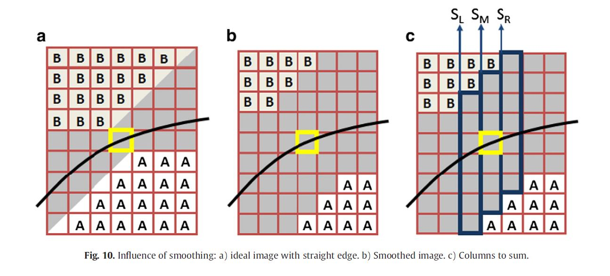

[Version en español](./Method_ES.md)

<h2>Theoretical development of the method:</h2>

We can divide the explanation of the method into three levels of complexity: a first basic approach on which the technique is based, which will subsequently be perfected, in which fixed-size windows are used; a second approach where fixed-size windows are still used, but this time a Gaussian filter is applied to the image first; and a third approach that uses floating windows of variable size for detection of very close edges.

<h3>First approximation:</h3>

In this first approximation 3x5 size windows will be used. Before describing how the method works with this type of window, we can establish the main formula from which the method will be completely derived.

If we assume that a pixel is traversed by an edge, we can estimate the final hue of the sides from the hue of the pixel. If we call F the tone of each pixel, and A and B the tones of the sides opposite the edge, we can mathematically establish the relationship between them:

$F(i,j) = B + {{A-B} \over {h^2}} P(i,j)$

Where h represents the size of the pixel side, which will henceforth take the value of 1, and P the area that covers tone A within the pixel. We can easily verify that when P is equal to 1, the hue of the pixel will have the value of A, while when the value of the area P is equal to 0, the hue will be B.

Thanks to this simple formula we can build the method with static windows. As we said earlier in this first approximation we will use a window size of 3x5. To illustrate this approximation we are going to assume that the edge crosses the window from left to right and that its slope is between 0 and 1. With this assumption we make sure that the edge completely goes through the window from side to side. If we also assume that the edge is straight, we can calculate the parameters of this line using the variation of the adjoining vertical areas of the window to propose a system of equations.

	

Following the scheme of the first formula, we can establish the formulas of the accumulated hues of each vertical strip in relation to the two hues of the border and to the area covered by the hue A:

$$S_L = \sum_{n = {j-2}}^{j+2} F_{i-1,n} = 5B + {{A-B} \over {h^2}} L   $$

$$S_M = \sum_{n = {j-2}}^{j+2} F_{i,n} = 5B + {{A-B} \over {h^2}} M     $$

$$S_R = \sum_{n = {j-2}}^{j+2} F_{i+1,n} = 5B + {{A-B} \over {h^2}} R$$

Now we can express the area of ​​each strip as the integral of the line that crosses the strip. Since the line presents two unknown quantities (a) and (b) we can already propose a system of equations with the three previous equations and with the areas of A expressed as integrals:

$$L = \int_{-3h/2}^{-h/2} (a + bx + {5 \over 2} h)\, dx = ah - bh^2 + {5 \over 2} h^2$$

$$M = \int_{-h/2}^{h/2} (a + bx + {5 \over 2} h)\, dx = ah + {5 \over 2} h^2$$

$$R = \int_{h/2}^{3h/2} (a + bx + {5 \over 2} h)\, dx = ah + bh^2 + {5 \over 2} h^2$$

Solving the system of equations we reach the expressions of (a) and (b) as a function of the hues A and B and the known values ​​of the sums of the hues of the three strips:

$$a = {{2S_M - 5(A+B)} \over {2(A-B)}} h$$

$$b = {{S_R-S_L} \over {2(A-B)}}$$

Being (a) the vertical distance in the central position of the window.

To complete this first approximation we need to determine what hues we will take as A and B. To estimate these hues, we take the average of the three pixels of each corner opposite the edge that throughs the window. Since we are assuming that the edge slope is between 0 and 1, we will have to take the upper left and lower right corners of the window, this is:

$$A = {1 \over 3} (F_{i,j+2} + F_{i+1,j+2} + F_{i+1,j+1})$$

$$B = {1 \over 3} (F_{i-1,j-1} + F_{i-1,j-2} + F_{i,j-2})$$

With the data of A, B and the line we can express the normal and establish its sign and its modulus as the difference of the hues A and B:

$$N = {{A-B} \over \sqrt{1+b^2}} [b, -1]$$

<h3>Quadratic approximation:</h3>

As in the case of the approximation by means of a straight line, the approximation by means of a parabola follows the same mechanics, only this time there is one more variable. Since the curve through the window is a parabola, the integrals of each strip will be calculated adjusting to the curve $y = a + bx + cx^2$, and adding its center to the independent term, we obtain:

$$L = \int_{-3h/2}^{-h/2} (a + bx + cx^2 + {5 \over 2} h)\, dx = ah - bh^2 + {13 \over 12} ch^3 + {5 \over 2} h^2$$

$$M = \int_{-h/2}^{h/2} (a + bx + cx^2 + {5 \over 2} h)\, dx = ah + {1 \over 12} ch^3 + {5 \over 2} h^2$$

$$R = \int_{h/2}^{3h/2} (a + bx + cx^2 + {5 \over 2} h)\, dx = ah + bh^2 + {13 \over 12} ch^3 + {5 \over 2} h^2$$

Solving the system of equations we get the result:

$$c = {{S_L + S_R - 2S_M} \over {2(A-B)}}$$

$$b = {{S_R - S_L} \over {2(A-B)}}$$

$$a = {{2S_M-5(A+B)} \over {2(A-B)}} - {1 \over 12} c$$

From which we can estimate the curvature at x = 0 as:

$$K = {{2c} \over {(1+b^2)^{3/2}}}$$

<h3>Generalization to any slope value:</h3>

The method as we have explained so far is based on the assumption that the slope of the curve is between 0 and 1. So we must generalize the method so that it works in all possible conditions. To generalize the method we can distinguish two limit situations. We can first suppose the cases where the edge slopes are between -1 and 1, so the resulting curve can be detected using a 3x5 vertical window. The second case, in which the edge slopes are greater than 1 in absolute value, we can use the same method but this time using 5x3 horizontal windows.

Within these two cases, we can differentiate, in turn, two cases in which the slopes are between 0 and 1 or between -1 and 0. The difference between these two cases apears when it attempts to calculating the hues of the corners of the windows. To solve this, we simply make use of a variable (m) that adds or subtracts the unit so that the ends are permuted to the right or to the left.

$$
m = \left\{
\begin{array}{rcl}
    1 & \text{si} & f_x(i,j)f_y(i,j) > 0\\
    -1 & \text{si} & f_x(i,j)f_y(i,j) \leq 0
\end{array}
\right.
$$

So now the calculations of the limit hues will be:

$$A = {1 \over 3} (F_{i,j+2} + F_{i-m,j+2} + F_{i-m,j+1})$$

$$B = {1 \over 3} (F_{i+m,j-1} + F_{i+m,j-2} + F_{i,j-2})$$

We can also distinguish situations where the curve bends toward higher or lower hue values. For example, suppose the case of a circumference in which the interior hue is greater than the exterior hue, in this case the curvature must always be negative, so a generalization like the previous one is necessary, but this time for the curvature:

$$K = {{2cn} \over {(1+b^2)^{3/2}}}$$

Being n:

$$
  n = \left\{
  \begin{array}{rcl}
    1 & \text{si} & f_y(i,j) \gt 0\\
   	&           &       \\
    -1 & \text{si} & f_y(i,j) \leq 0\\
 	\end{array}
  \right.
$$

In the case that the edges are purely vertical, that is, in those cases in which the slope is greater in absolute value than 1, no change in the algorithm will be necessary, only it will now adjust to the expression $x = a + by + cy^2$, and the horizontal distance to the center will be this time at y = 0 equal to (a). The normal vector will not vary, and the expression for the corner calculations will be:

$$A = {1 \over 3} (F_{i+2,j} + F_{i+2,j-m} + F_{i+1,j-m})$$

$$B = {1 \over 3} (F_{i-1,j+m} + F_{i-2,j+m} + F_{i-2,j})$$

<h3>Determination of edge pixels:</h3>

For this method to work it is necessary to determine which pixels will be marked as edge pixels. As we explained in the introduction, we take as candidate pixels all those whose gradient modulus exceeds a certain threshold. Furthermore, the above condition is not sufficient since for the pixel to be considered as an edge, it must also be a pixel with a maximum gradient modulus between those connected to it. To determine if a pixel has a maximum value in its neighborhood, we must consider whether the pixel constitutes a vertical or horizontal border. If the pixel is vertical its partial derivative $f_x$ will be greater than $f_y$, in the horizontal case it will be the opposite. Therefore, it will be a sufficient condition that the following inequalities are met:

In the vertical case:

$$
\left\{
\begin{array}{l}
    |f_x(i,j)| > |f_y(i,j)|\\
    \quad\\
    |f_x(i-1,j)| \leq |f_x(i,j)| \geq |f_x(i+1,j)|
\end{array}
\right.
$$

And in the horizontal case:

$$
\left\{
\begin{array}{l}
    |f_y(i,j)| \gt |f_x(i,j)| \\
    \quad\\
    |f_y(i,j-1)| \leq |f_y(i,j)| \geq |f_y(i,j+1)| \\
\end{array}
\right.
$$

<h3>Second approach (Images with noise):</h3>

In cases where the image that you want to process presents noise - generally every real image presents it - we have the possibility of smoothing the edges by first applying a Gaussian filter. The method in this case does not need any conceptual modification, however it produces an alteration in the formulation of the system of equations and therefore also in the result thereof.

The Gaussian matrix that we will use will be 3x3 and will be made up as follows:

$$
K = \left(
  \begin{array}{lcr}
    a_{11} & a_{01} & a_{11} \\
    a_{01} & a_{00} & a_{01} \\
    a_{11} & a_{01} & a_{11}
  \end{array} \right)
$$

The matrix must also fulfill that $a_{00} \gt a_{01} \gt a_{11}$ and also $a_{00} + 4a_{01} + 4a_{11} = 1$

As a result of the smoothing process, an alteration occurs in the area that encompasses pixels with intermediate values ​​between A and B. This area is now larger, as can be seen in the following image:

	

Let us set G as the smoothed image, and again assume the ideal case where the edge slope is between -1 and 1, and considering again the variable (m) in the same way as in the previous case but this time evaluated on the partial derivatives of G; we can express the sums of the columns of the window as:

$$S_L = \sum_{k = {-3-m}}^{3-m} G_{i-1,j+k}$$

$$S_M = \sum_{k = {-3}}^{3} G_{i,j+k}$$

$$S_R = \sum_{k = {-3+m}}^{3+m} G_{i+1,j+k}$$

As can be seen, the size of the vertical stripes is now 7 and they are offset so that they fit optimally to the estimated outline of the edge. This new setting of window stripes and the modified pixel values of G​​ result in the following system solution:

$$c = {{S_L + S_R - 2S_M} \over {2(A-B)}}$$

$$b = m + {{S_R - S_L} \over {2(A-B)}}$$

$$a = {{2S_M-7(A+B)} \over {2(A-B)}} - {{1+24a_{01}+48a_{11}}  \over 12} c$$

*We have omitted the details of the operations leading to this solution. For more detailed calculations, see the original article.*

As the windows are different, the estimation of hues A and B will also be affected. The hues for the horizontal case are now:

$$A = {1 \over 3} (F_{i,j+4} + F_{i-m,j+4} + F_{i-m,j+3})$$

$$B = {1 \over 3} (F_{i+m,j-3} + F_{i+m,j-4} + F_{i,j-4})$$

In the case of vertical edges, it can be easily deduced from what has been explained so far, so we leave it as an exercise for the reader.

<h3>Detection of nearby edges by means of floating windows:</h3>

In cases where the image contains edges that are very close to each other, so that more than one edge passes through a window, it is necessary to adapt the method, for which it was devised that the windows could dynamically change their size.

To implement this solution, three pairs of new variables are used: (l1, l2), (m1, m2), and (r1, r2). Each pair of variables will establish the limits of its stripe, so that the sums of the stripes will be altered, resulting as follows:

$$S_L = \sum_{k = {l_1}}^{l_2} G_{i-1,j+k}$$

$$S_M = \sum_{k = {m_1}}^{m_2} G_{i,j+k}$$

$$S_R = \sum_{k = {r_1}}^{r_2} G_{i+1,j+k}$$

By altering the calculation of the accumulated sums of the hues of the stripes, the system of equations is altered, operating once again the new solution is reached:

$$c = {{S_L + S_R - 2S_M} \over {2(A - B)}} + {{A(2m_2 - l_2 - r_2)-B(2m_1 - l_1 - r_1)} \over {2(A - B)}}$$

$$b = {{S_R - S_L} \over {2(A-B)}} + {{A(l_2 - r_2) - B(l_1 - r_1)} \over {2(A - B)}}            $$

$$a = {{2S_M - A(1 + 2m_2) - B(1 - 2m_1)} \over {2(A - B)}} - {{1 + 24a_01 + 48a_11}  \over 12} c$$

*We have again omitted the intermediate calculations that lead us to the solution. Details of these calculations can be found in the original article.*

The estimates of hues A and B are made in a slightly different way. This time the generalization using the variable (m) does not help us, so we have to distinguish the cases in which the edge slope is positive or negative.

In the case of horizontal edges and positive slopes, they would be calculated as:

$$A = {1 \over 2} (G_{i,j+m_2} + G_{i+1,j+r_2})$$

$$B = {1 \over 2} (G_{i-1,j+l_1} + G_{i,j+m_1})$$

For horizontal slopes with negative slope:

$$A = {1 \over 2} (G_{i-1,j+l_2} + G_{i,j+m_2})$$

$$B = {1 \over 2} (G_{i,j+m_1} + G_{i+1,j+r_1})$$

We leave the vertical border cases again as an exercise for the reader.
