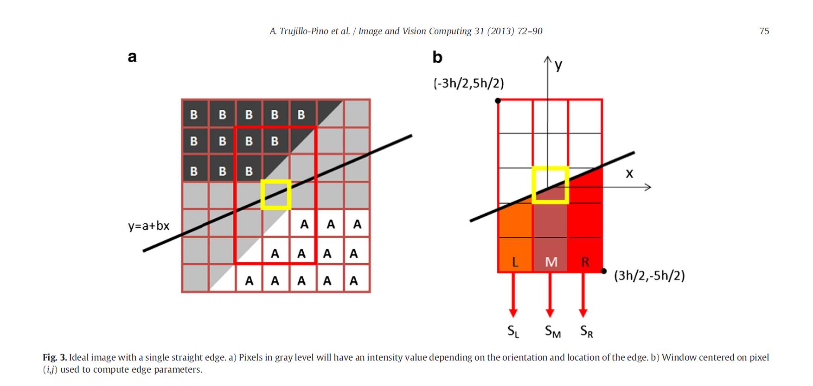
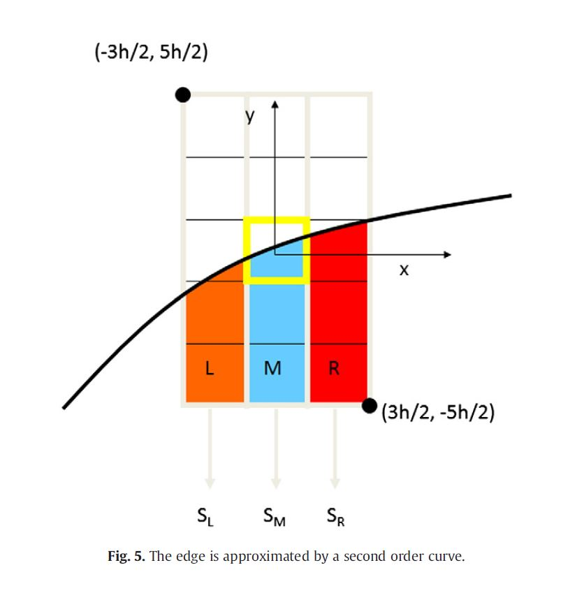

<h1>Método de detección de bordes a nivel subpíxel:</h1>

Este proyecto es una implantación en C++ del método desarrollado en el artículo ["Accurate subpixel edge location based on partial area effect"](https://www.sciencedirect.com/science/article/abs/pii/S0262885612001850) escrito por Agustín Trujillo et al. Su implementación en Matlab se puede descargar de [MathWroks](https://es.mathworks.com/matlabcentral/fileexchange/48908-accurate-subpixel-edge-location). Las diapositivas que muestran el funcionamiento de este método se pueden descargar de MathWorks o de este mismo repositorio.

Este proyecto forma parte del mi trabajo de fin de grado (TFG) que hemos desarrollado desde la Universidad de Las Palmas de Gran Canaria en el curso 2019/20 para la obtención del título de Ingeniería Informática en la especialidad de Computación.

<h3>Autores:</h3>

- Agustín Rafael Trujillo Pino - <agustin.trujillo@ulpgc.es> - Tutor
- Juan Sebastián Ramírez Artiles - <juan.ramirez107@alu.ulpgc.es>

<h3>Instalación del proyecto en Visual Studio:</h3>

Para la implementación del método hemos hecho uso de la librería OpenCV en la versión 4.3.0 x64 vc15, y del software Microsoft Visual C++ 2019 en su versión Community. Para aclarar los detalles de la instalación puede consultar el documento [Instalación VS.pdf](https://github.com/juanse77/EdgeLocator/blob/master/Instalaci%C3%B3n%20VS.pdf).

<h2>Descripción del método:</h2>

En este documento vamos a explicar brevemente en qué consiste el método y cómo se ha implantado en C++.

Este método es una mejora importante de los métodos clásicos de detección de bordes utilizados tradicionalmente, como son los filtros Sobel o los Canny. En este método se consigue detectar no solo los bordes a nivel de píxel sino que se logra hacer una estimación bastante precisa del trazado de los bordes a nivel subpíxel. Este método permite calcular los datos de posición del trazo dentro del píxel, así como su curvatura y su normal.

En el primer paso del algoritmo se transforma la imagen a blanco y negro. Con la imagen en blanco y negro se pasa a detectar los bordes a nivel píxel, para lo cual se utilizan los filtros Sobel. Con los filtros Sobel obtenemos las derivadas parciales en los ejes X e Y, y con ello una matriz de los vectores gradientes de todos los pixeles de la imagen. Por último en este primer paso, se utiliza la matriz de vectores gradientes para detectar los píxeles que posean un valor mayor a un cierto umbral y que su módulo sea máximo entre los píxeles de su vecindad.

Para detectar los trazos a nivel subpíxel se hace uso de un sistema de ventanas que abarcan las zonas próximas de cada píxel borde, de modo que, tomando los valores de intensidad de color de los píxeles de los extremos más alejados de los bordes, se procede a realizar los cálculos que finalmente permitirán trazar las líneas continuas a través de cada píxel borde.
  

Podemos dividir la explicación del método en tres niveles de complejidad: una primera aproximación básica en la que se fundamenta la técnica que posteriormente se irá perfeccionando, en la cual se hace uso de ventanas de tamaño fijo; una segunda aproximación en la cual se sigue haciendo uso de ventanas de tamaño fijo pero esta vez se le ha aplicado primero un filtro gaussiano a la imagen; y una tercera aproximación en la que se utilizan ventanas flotantes de tamaño variable para la detección de bordes muy próximos entre sí.

<h3>Primera aproximación:</h3>

En esta primera paroximación se utilizarán ventanas de tamaño 3x5. Antes de describir cómo funcionaría el método con este tipo de ventana podríamos establecer la fórmula principal de la que derivará por completo el método.

Si suponemos que un píxel resulta atravesado por un borde, podemos estimar la tonalidad final de los lados a partir de la tonalidad del píxel. Si llamamos F al tono de cada píxel, y A y B a los tonos de los lados opuestos por el borde, podemos establecer matemáticamente la relación que existe entre ellos:

%20%3D%20B%20%2B%20%7B%7BA-B%7D%20%5Cover%20%7Bh%5E2%7D%7D%20P(i%2Cj)) 

Donde la h representa el tamaño del lado del píxel, que en adelante tomará el valor de 1, y P el área que cubre el tono A dentro del pixel. Podemos comprobar fácilmente que cuando P es igual a 1 el tono del pixel tendrá el valor de A, mientras que cuando el valor del área P es igual 0 el tono será B.

Gracias a esta sencilla fórmula podemos construir el método con ventanas estáticas. Como dijimos anteriormente en esta primera aproximación utilizaremos un tamaño de ventana de 3x5. Para ilustrar esta aproximación vamos a suponer que el borde atraviesa la ventana de izquierda a derecha y que su pendiente se encuentra entre 0 y 1. Con esta suposición nos aseguramos de que el borde atraviesa por completo la ventana de lado a lado. Si suponemos, además, que el borde es recto podemos calcular los parámetros de esta recta, planteando un sistema de ecuaciones utilizando la variación de las áreas verticales colindantes de la ventana.

	

Siguiendo el esquema de la primera fórmula, podemos establecer las fórmulas de las tonalidades acumuladas de cada franja vertical en realción a los dos tonos del borde y al área que abarca la tonalidad A:

Ahora podemos expresar el área de cada franja como la integral de la recta que atraviesa la franja, como la recta presenta dos incógnitas (a) y (b) ya podemos plantear un sistema de ecuaciones con las tres anteriores ecuaciones y con las expresiones de las áreas de A expresadas como integrales:

%5C%2C%20dx%20%3D%20ah%20-%20bh%5E2%20%2B%20%7B5%20%5Cover%202%7D%20h%5E2)

%5C%2C%20dx%20%3D%20ah%20%2B%20%7B5%20%5Cover%202%7D%20h%5E2)

%5C%2C%20dx%20%3D%20ah%20%2B%20bh%5E2%20%2B%20%7B5%20%5Cover%202%7D%20h%5E2)

Resolviendo el sistema de ecuaciones llegamos a las expresiones de (a) y (b) en función de los tonos A y B y a los valores conocidos de las sumas de los tonos de las tres franjas:

%7D%20%5Cover%20%7B2(A-B)%7D%7D%20h)

%7D%7D)

Siendo (a) la distancia vertical en la posición central de la ventana.

Para completar esta primera aproximación nos falta determinar qué tonos tomaremos como A y B. Para estimar estos tonos tomamos la media de los tres píxeles de cada esquina opuesta al borde que atraviesa la ventana. Como estamos suponiendo que la pendiente del borde se encuentra entre 0 y 1, deberemos tomar las esquinas superior izquierda e inferior derecha de la ventana, esto es:

)

)

Con los datos de A, B y de la recta podemos expresar la normal y establecer su signo y su módulo como la diferencia de las tonalidades A y B:

![\displaystyle N = {{A-B} \over \sqrt{1+b^2}} \[b, -1\]](https://render.githubusercontent.com/render/math?math=%5Cdisplaystyle%20N%20%3D%20%7B%7BA-B%7D%20%5Cover%20%5Csqrt%7B1%2Bb%5E2%7D%7D%20%5Bb%2C%20-1%5D)

<h3>Aproximación cuadrática:</h3>

Como en el caso de la aproximaxión mediante una recta, la aproximación mediante una parábola sigue la misma mecánica, solo que esta vez hay una variable más. Al ser una parábola la curva que atraviesa la ventana, las integrales de cada franja se calcularán ajustandose a la curva , y sumando su centro al término independiente:

%5C%2C%20dx%20%3D%20ah%20-%20bh%5E2%20%2B%20%7B13%20%5Cover%2012%7D%20ch%5E3%20%2B%20%7B5%20%5Cover%202%7D%20h%5E2)

%5C%2C%20dx%20%3D%20ah%20%2B%20%7B1%20%5Cover%2012%7D%20ch%5E3%20%2B%20%7B5%20%5Cover%202%7D%20h%5E2)

%5C%2C%20dx%20%3D%20ah%20%2B%20bh%5E2%20%2B%20%7B13%20%5Cover%2012%7D%20ch%5E3%20%2B%20%7B5%20%5Cover%202%7D%20h%5E2)

Resolviendo el sistema de ecuaciones llegamos al resultado:

%7D%7D)

%7D%7D)

%7D%20%5Cover%20%7B2(A-B)%7D%7D%20-%20%7B1%20%5Cover%2012%7D%20c)

De lo cual podemos estimar la curvatura en x = 0 como:

%5E%7B3%2F2%7D%7D%7D)

<h3>Generalización a cualquier valor de pendiente</h3>

El método tal y como lo hemos explicado hasta ahora se basa en la suposición de que la pendiente de la curva se encuantre entre 0 y 1. Por lo que debemos generalizar el método para que funcione en todas las condiciones posibles. Para generalizar el método podemos distinguir dos situaciones límite. Primero podemos suponer los casos en los que las pendientes del borde estén entre -1 y 1, por lo que la curva resultante se puede detectar usando una ventana vertical de 3x5. El segundo caso, en el que las pendientes de los bordes sean superiores a 1 en valor absoluto, podemos utilizar el mismo método pero usando esta vez ventanas horizontales de 5x3.

Dentro de estos dos casos, podemos diferenciar, a su vez, dos casos en los que las pendientes se encuentren entre 0 y 1 o entre -1 y 0. La diferencia entre estos dos casos se presenta cuando se intenta calcular los tonos de las esquinas de las ventanas. Para solucionar esto, simplemente hacemos uso de una variable (m) que sume o reste la unidad de modo que se permute los extremos hacia la derecha o hacia la izquierda.

f_y(i%2Cj)%20%5Cgt%200%5C%5C%20%09%20%20%26%20%20%20%20%20%20%20%20%20%20%20%26%20%20%20%20%20%20%20%5C%5C%20%09-1%20%26%20%5Cmbox%7Bsi%7D%20%26%20f_x(i%2Cj)f_y(i%2Cj)%20%5Cleq%200%5C%5C%20%09%5Cend%7Barray%7D%20%5Cright.)

Por lo que ahora los cálculos de los tonos límite será:

)

)

También podemos distinguir las situaciones en las que la curva se doble hacia valores de tonos más altos o más bajos. Por ejemplo, supongamos el caso de una circunferencia en la que el tono interior es mayor al tono inferior, en este caso la curvatura deberá ser siempre negativa, por lo que se hace necesaria una generalización como la anterior pero esta vez para la curvatura:

%5E%7B3%2F2%7D%7D%7D)

Siendo n:

%20%5Cgt%200%5C%5C%20%09%20%20%26%20%20%20%20%20%20%20%20%20%20%20%26%20%20%20%20%20%20%20%5C%5C%20%09-1%20%26%20%5Cmbox%7Bsi%7D%20%26%20f_y(i%2Cj)%20%5Cleq%200%5C%5C%20%09%5Cend%7Barray%7D%20%5Cright.)

En el caso de que los bordes sean netamente verticales, es decir, en aquellos casos en los que la pendiente sea mayor en valor absoluto a 1, no hará falta ningún cambio en el algoritmo, solo que ahora se ajustará a la expresión , y la distancia horizontal al centro será esta vez en y = 0 igual a (a). El vector normal no variará, y la expresión para los cálculos de las esquinas será:

)

)

 
