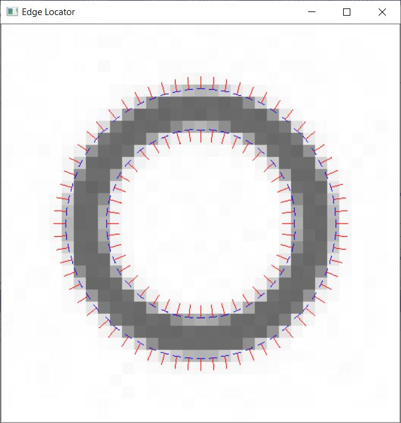

<h1>Método de detección de bordes a nivel subpíxel:</h1>

Este proyecto es una implementación en C++ del método desarrollado en el artículo ["Accurate subpixel edge location based on partial area effect"](https://www.sciencedirect.com/science/article/abs/pii/S0262885612001850) escrito por Agustín Trujillo et al. Su implementación en Matlab se puede descargar de [MathWroks](https://es.mathworks.com/matlabcentral/fileexchange/48908-accurate-subpixel-edge-location). Las diapositivas que muestran el funcionamiento de este método se pueden descargar de MathWorks o de este mismo repositorio.

Este proyecto forma parte del mi trabajo de fin de grado (TFG) que hemos desarrollado desde la Universidad de Las Palmas de Gran Canaria en el curso 2019/20 para la obtención del título de Ingeniería Informática en la especialidad de Computación.

<h3>Autores:</h3>

- Agustín Rafael Trujillo Pino - <agustin.trujillo@ulpgc.es> - Tutor
- Juan Sebastián Ramírez Artiles - <juan.ramirez107@alu.ulpgc.es>

<h3>Instalación del proyecto en Visual Studio:</h3>

Para la implementación del método hemos hecho uso de la librería OpenCV en la versión 4.3.0 x64 vc15, y del software Microsoft Visual C++ 2019 en su versión Community. Para aclarar los detalles de la instalación puede consultar el documento [Instalación VS.pdf](https://github.com/juanse77/EdgeLocator/blob/master/Instalation_in_VS.pdf). No obstante, si lo que desea es probar el funcionamiento de la aplicación puede ejecutar el programa precompilado descargable desde este mismo repositorio -[EdgeLocator_1.0](EdgeLocator_1.0.zip)-. Los detalles de su funcionamiento se describen más abajo en el punto *Interfaz de la aplicación*.

<h2>Descripción del método:</h2>

En este documento vamos a explicar brevemente en qué consiste el método y cómo se ha implantado en C++.

Este método es una mejora importante de los métodos clásicos de detección de bordes utilizados tradicionalmente, como son los filtros Sobel o los Canny. En este método se consigue detectar no solo los bordes a nivel de píxel sino que se logra hacer una estimación bastante precisa del trazado de los bordes a nivel subpíxel. Este método permite calcular los datos de posición del trazo dentro del píxel, así como su curvatura y su normal.

Imagen de test             |  Captura angio
:-------------------------:|:-------------------------:
  |  

En el primer paso del algoritmo se transforma la imagen a blanco y negro. Con la imagen en blanco y negro se pasa a detectar los bordes a nivel píxel, para lo cual se utilizan los filtros Sobel. Con los filtros Sobel obtenemos las derivadas parciales en los ejes X e Y, y con ello una matriz de los vectores gradientes de todos los píxeles de la imagen. Por último, en este primer paso, se utilizan los módulos del gradiente de cada pixel para detectar todos los píxeles que posean un valor mayor a un cierto umbral y que además, sean máximos entre los píxeles de su vecindad.

Para detectar los trazos a nivel subpíxel, se ha diseñado un sistema de ventanas que cubre las áreas proximas de cada píxel borde, de modo que, tomando los valores de intensidad de color de los píxeles de la ventana en los extremos más alejados de la porción de borde, podemos realizar los cálculos que finalmente nos permitirán dibujar las líneas continuas a través de cada píxel de borde.
  

Más información en:

- [Desarrollo teórico de método](./Method_ES.md).
- [Detalles de implementación](./Implementation_ES.md).

<h3>Interfaz de la aplicación:</h3>

La interfaz de la aplicación es la consola y usa la ventana nativa de OpenCV. Para probar la aplicación puede descargar los fuentes y compilarlos o usar el fichero binario [EdgeLocator_1.0](EdgeLocator_1.0.zip) contenido en este repositorio. Al descomprimirlo verá que existe una estructura de carpetas. En la carpeta images deberá situar los ficheros de imagen que desee procesar. Las carpetas jsonData y accuracyResults sirven para guardar resultados de la ejecución. En la carpeta jsonData se guardarán  en formato json los parámetros de los bordes calculados en la ejecución, siempre y cuando se haya activado la opción -s en el comando. La carpeta accuracyResults se usará para guardar las estadísticas de la ejecución de test.

El comando admite una serie de parámetros que alteran su funcionamiento. La formato del comando es:

*EdgeLocator.exe -f fileName [-t (0,255)] [-o (1,2)] [-m (0,3)] [-s]*

Un ejemplo podría ser:

*EdgeLocator.exe -f angio2.png -t 20*

Donde la opción -f corresponde al fichero de entrada que debe existir en la carpeta images. La opción -t corresponde al umbral del gradiente. La opción -o al orden de ajuste: 1 para ajustar a rectas, y 2 para ajustar a parábolas. La opción -m permite seleccionar la versión del método a usar: 0 ventanas flotantes con suavizado; 1 ventanas flotantes sin suavizado; 2 ventanas estáticas con suavizado; y 3 ventanas estáticas sin suavizado. Por último, la opción -s permite volcar todos los parámetros de bordes calculados en el método a un fichero json. El fichero se almacenará en la carpeta jsonData y su nombre será el mismo que el de la imagen de entrada pero su extensión será ahora .json.

El programa en ejecución permite la interación con una serie de controles de teclado. Las teclas de dirección sirven para moverse por la imagen, mientras que la tecla (u) aumenta el zoom, la tecla (d) reduce el zoom, la tecla (t) genera y calcula los bordes de la imagen de test, y la tecla (q) aborta el programa.

Esta implantación en C++ del método se ha concebido con la intención de que sea una herramienta que facilite la implantación en cualquier otro lenguaje, ya sea Java, Python, o alguna tecnología .Net. Esperamos que les haya gustado el método y les animamos a que se descarguen el código fuente y experimenten con él.

Gracias por leer el guión y estamos a su disposición a través de nuestras direcciones de email.

<h3>Resursos utilizados:</h3>

- [Visual Studio 2019 Community](https://visualstudio.microsoft.com/es/vs/community/).
- [OpenCV 4.3.0](https://opencv.org/opencv-4-3-0/).
- [Biblioteca JSON nlomann](https://github.com/nlohmann/json)
- [GetOpt para Windows](https://github.com/iotivity/iotivity/tree/master/resource/c_common/windows/src) 